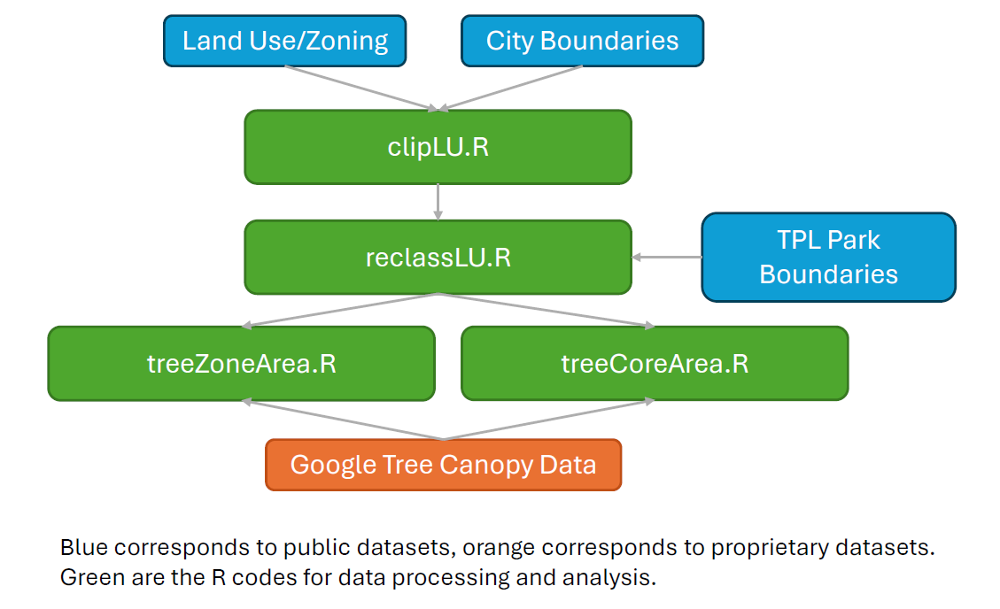

# Bridging the land use gap: Examining tree canopy cover and connectivity by land use in 10 U.S. cities
This research assess the distribution of tree canopy cover by land use (single-family, multi-family, parks, and industrial) in 10 U.S. cities. The cities are tested: Chicago, IL; Houston, TX; Indianapolis, IN; Jacksonville, FL; Los Angeles, CA; New York, NY; Phoenix, AZ; Portland, OR; Seattle, WA; and Saint Louis; MO. Analysis utilizes publicly available park, land use, and zoning data along with proprietary tree canopy data from Google's [Environmental Insights Explorer](https://insights.sustainability.google/).

## Citation:
Stuhlmacher, M., Williams, D., Impellizeri, C., and Curran, W. (2025). “Bridging the land use gap: Examining tree canopy cover and connectivity by land use in 10 U.S. Cities”. Urban Forestry and Urban Greening. https://doi.org/10.1016/j.ufug.2024.128626

## Methdology Diagram:

# Software Requirements:
R version 4.2.1
